# Clean Code Reflection

Chapters [2,3,4,5,6,7,8,9,10,11].forEach (chapter) => (chapter){ chapter.affect(myCode) || !chapter.affect(myCode) }  
Programming humor aside, I'm about to reflect on how each chapter has (or has not) influenced the coding decisions in this project.

## Chapter 2: Meaningful Names

Despites the relative harsh review of this chapter in my previous reflection, I consider this to be the most important chapter in the book.  
In fact I would argue that if anyone is to take away only one thing from this book, it should be the importance of meaningful names.  
Having clear and distinct names for variables, functions, classes, etc. is the most important thing to keep in mind when writing code in order to make it readable.  
Although I maintain my opinion that the chapter is too long and rambling.  

Example from src/classes/controller/GameController.ts row 45-74 shows how I have tried to make the code readable by using meaningful names.  
isThereASavedGame is a bit long, but I think it is worth it for the clarity.  
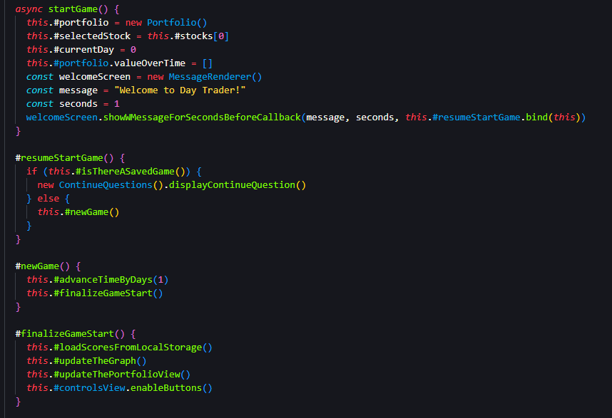  
Judged impact on my code: 10/10

## Chapter 3: Functions

This chapter is primarily about making sure your code is testable... It doesn't outright say it, but that's what it's about in the core.  
Everything else in this chapter is already covered in chapter 2, or a direct consequence of the code being testable.  
Functions being short and only doing one thing, and keeping the number of arguments low are all things that are important for testability.  
I still think the ideal function length of 4 rows and zero arguments is excessive, but have made efforts in that direction to try it out.

Trying to follow the goals of chapter 3 to the extreme, I found they pushed me towards a way of programming that carried a high risk of side effects as variables were pushed further up the scope chain. This also kills the idea of having functions that only do one thing, as they now have to do the thing they were supposed to do, and also update the variables that are now in the scope chain, but were previously arguments to the function.

The zero argument ideal also would be the bane of dependency injection, a practice that I have found to be very useful, and in general a hallowed practice in the world of programming.

Example from src/classes/view/RightControlsView.ts row 74-111.  
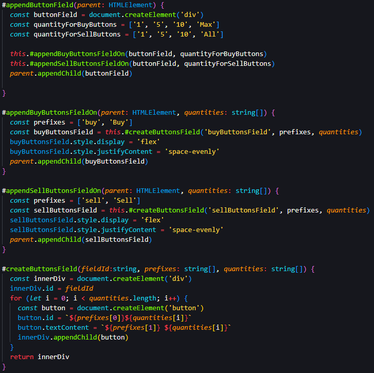  
Judged impact on my code: 7/10

## Chapter 4: Comments

This chapter is about comments, and how they should be used. Or rather, how they should not be used. Preferably not at all.  
The chapter states mandatory comments are bane, and I agree there is little I dislike more than having to write a mandated javadoc comment for a function that is self explanatory.

I largely agree with the chapter, some comments are necessary and / or useful but most are not.  
TODO comments are useful, same with Warnings and some Notes... most other comments are just noise.  
But I do think that the chapter is a bit too harsh on comments, and that they sometimes are necessary to explain why something is done in a certain way in special cases, thus preventing the next developer from "fixing" something thats done in a certain way for a reason.  
For the most part the question, "does this improve understandability?" is a good one to ask when considering whether or not to write a comment.

Example from /src/config.ts row 1-36. By far my most commented file, but since it is a config file, I think it is justified.  
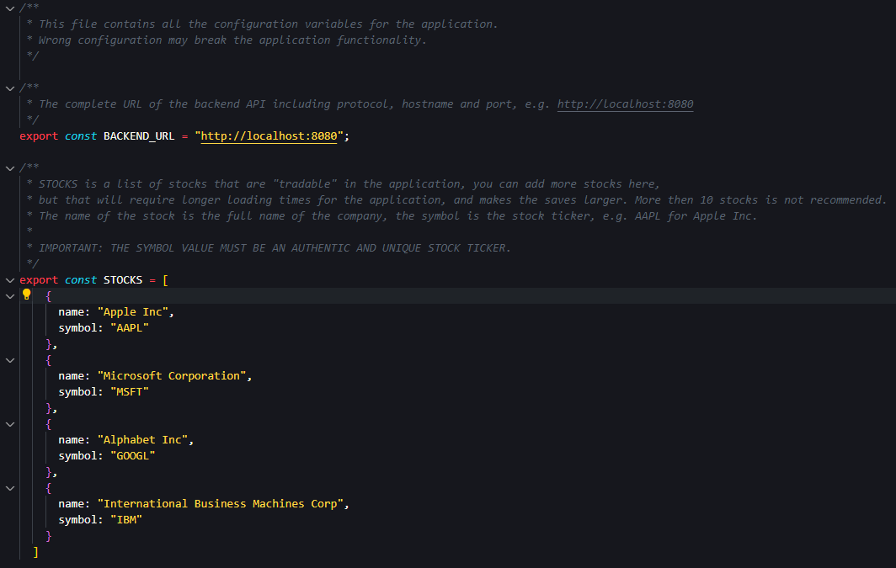  
Judged impact on my code: 8/10

## Chapter 5: Formatting

Personally I'm so used to the *"One True Brace Style"* variant of the K&R style that the horizontal indention by scope level comes naturally, and not having it feels wrong. Consequently I agreed with the chapter in the regard that indentation by scope makes it easier to see where a scope starts and ends. It increases readability.

I also agree that one-liner if statements and loops are bad for readability, and should be avoided.

The vertical density and Vertical distance rules make sense, you don't want to have to jump around in the code to follow the flow of the program. And you want to follow the conceptual affinity, things that are similar should be together. I try to follow this, but in honesty some code end up in chronological order of when it was written, and not in order of what makes sense to read first. At times I also dump long functions at the bottom of the file to get them out of the way. At least in early iterations of the code.

I believe you can summarize this chapter as "make your code readable", and I agree with that.  
Example from /src/classes/view/ContinueQuestion.ts row 1-42.  
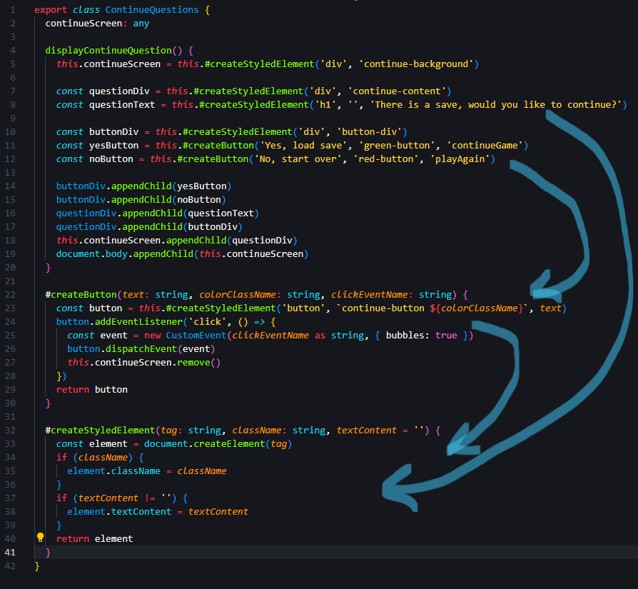  
Judged impact on my code: 7/10

## Chapter 6: Objects and Data Structures

Object have public behaviors and no or private data, data structures have public data and no or private behaviors... sounds simple enough.  
But I think the chapter is a bit too harsh on getters and setters, they are useful for validation and to make sure the data is in a valid state.  
They are not as bad as the chapter makes them out to be, "quasi-encapsulation" as Robert C. Martin calls it in Data Transfer Objects, is not a bad thing to force the data to be in a valid state. But I, if you have getters that return the data as is, and setters that set the data as is, then you might as well just have public data,  
even if, it honestly, feels very strange. I have tried using pure data structures in my models, but some like StockPurchase ended up Hybrid as I wanted quantity to be reduced, but not below zero, and not set directly.

Example from /src/model/Score.ts row 1-9: The DTO Score  
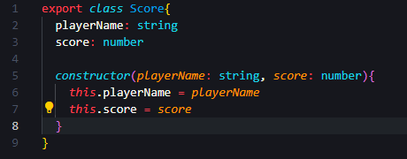  
Judged impact on my code: 5/10

## Chapter 7: Error Handling

This chapter is partly about how to handle errors, and about a third of it is about how to structure the flow of your program.  
It spends another third to argue that you should not return or pass nulls or error codes. I agree with that too an extent, I find a null or false useful some times but if, and only if its handled right away in the function/method that called them. Anything that needs to be looked up is a bad idea.  
The part that is about handling errors spend the wast majority of its inc to argue for the use of unchecked exceptions, and I agree with that wholeheartedly.

There is nothing worse than having code that dies silently, and you have no idea why. This is a bit of a problem in web development, as you don't want to show the user a stack trace, but you also don't want to just ignore the error.  From a debugging point of view,  I prefere the backend/Java way of doing things, where you have a stack trace and a message, and you can choose to show the user the message, and the stack trace is logged.

Example from /src/classes/models/Porfolio.ts row 85-110, the sellQuantityBySymbol method and how it reverts the changes if an error occurs.  
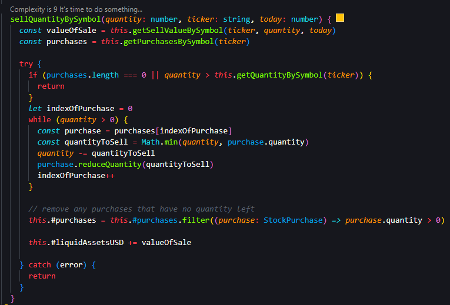  
Judged impact on my code: 4/10 (It likely be higher in a larger project or a non-web project)

## Chapter 8: Boundaries

Boundaries are about how to deal with code that you (or your team) does not control, understand, trust or that is not written in the same language or not written at all.  It goes on to state that you want to create a testable interface, be it an actual interface, wrapper class, bridge/adapter  to that code, and then use that interface in your code.  
This makes sense. It creates a clear separation between your code and the code you don't control. You also limit the amount of code that is affected if the code you don't control changes and have an easier time testing your code and replacing the code you don't control.

I see the point, but have not seen the need to impose any boundaries in this project since all the code is my own (apart from the node_modules but wrapping all of them would just be going way overboard). I have however made the boundary between the backend and the frontend clear, and the boundary between the frontend and the graphdrawer module as rigid as possible by strictly specifying the commit I use.

Example from /package.json row 22-25: The commit hash of the graphdrawer module.  
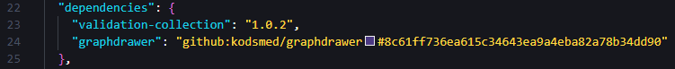  
Judged impact on my code: 1/10

## Chapter 9: Unit Tests

I love unit tests, they are great. They make sure your code does what it is supposed to do, and more importantly, they make sure your code keeps doing what it is supposed to do. While I agree with the One Concept per Test rule, I think the chapter is a bit too harsh on the One Assert per Test rule. I think it is fine to have multiple asserts in a test, as long as they are all testing the same thing. Testing if your constructor tests on faulty input should be one test, not one test for each faulty input. Also this makes the test more readable, as you don't have to read through a bunch of boilerplate to get to the actual test.

Web development is a bit tricky when it comes to unit tests, as you have to mock the DOM, and having the test "see" what is rendered on a canvas is overly challenging... hence I, sadly don't have any unit tests in this project, but I have tested the code manually, and the module have unit tests.

Example from /components/graphdrawer/test/ColorSettings.test.js in the graphdrawer module.  
*Throwback to chapter 3, functions with many arguments are harder to test.*  
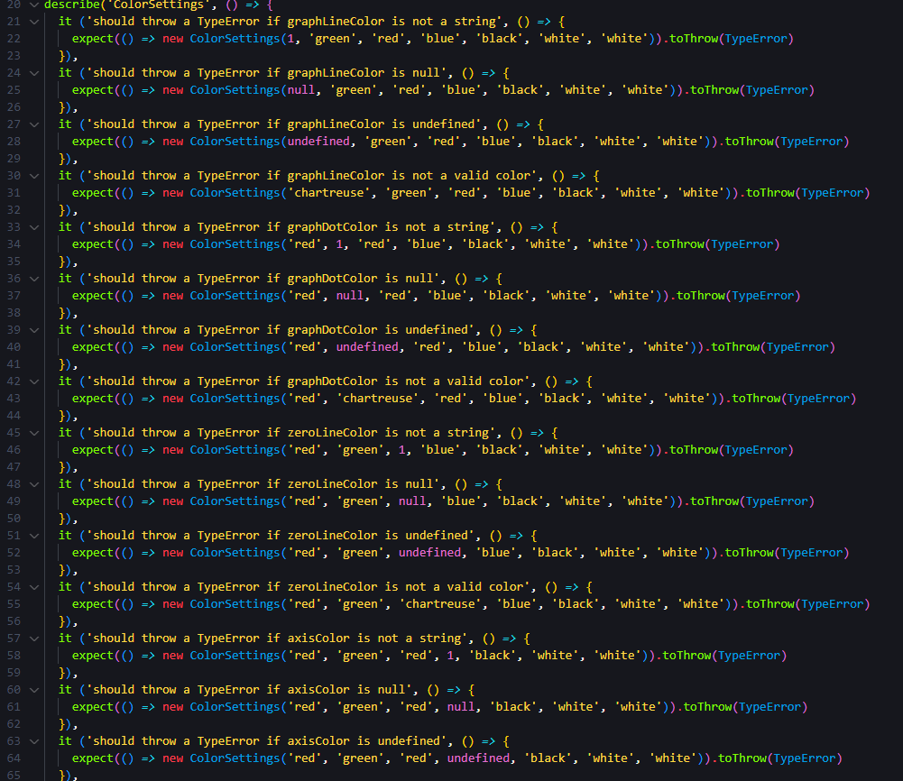  
Judged impact on my code: 4/10

## Chapter 10: Classes

Classes should be focused on one thing, and have a small number of instance variables, unless they are used in most methods.  
I was septical to this chapter at first, but I tried it out to a very far degree in my module and the classes exploded from 7 to 27,  
however, each of those classes are very small and focused on one thing, and I think it makes the code more readable.  
I now wish Visual Studio Code had a cohesion metric tool, as I think that would make for better classes.

However, this requires a lot of dependency injection, and what was that about zero arguments again?  
Also, the chapter should be clearer on that this is the end goal, and not something you should, or can, do from the start.  

Example from the github repo for the graphdrawer module, before and after refactoring:
| Before | After |
|--------|-------|
|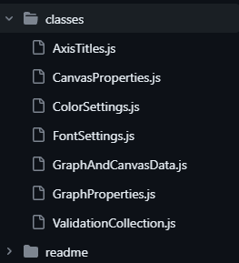|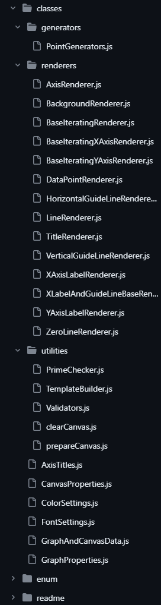|
Judged impact on my code: 8/10

## Chapter 11: Systems

Systems is a rinse and repeat of the previous chapters, but on a larger scale... and it too is a bit too long.  
It is about how to structure your code in terms of packages or classes, and how to make sure the packages are cohesive and loosely coupled.

Seperate Construction from Use is a point where I think Robert again is over reaching... A class constructor is not its own concern, it is part of the class. And while there defeinitely are cases where you want to seperate the construction from the use, and utilize factories, I don't think it is something you should do by default as the chapter seems to suggest. And to build everything upfront and then use it is not always possible, or even desirable as it drastically increases the startup time of the program and the memory footprint.

We both love dependency injection, but that they must come from a special container class or main is a very extreme, the parent class is a perfectly fine place to do it, and it is a lot easier to read and understand, and again... startup time and memory footprint.

I do agree that main should be largely separated from the rest of the code.  
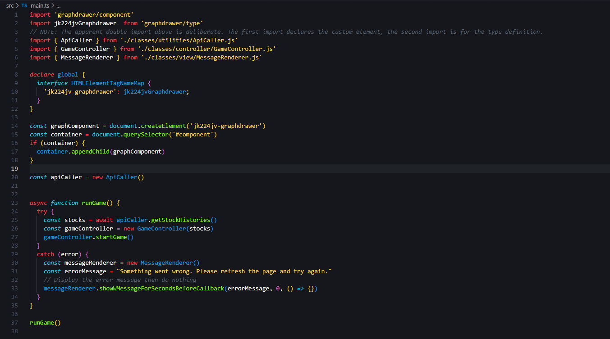  
Judged impact on my code: 3/10