# Test specification

Manual tests are described in the following sections. The tests are divided into two categories: tests for the API and tests for the web application.

Requirements:

- The Backend API server is installed and running on port 8080.
- The Frontend web application is installed and can be accessed via a web browser.
- You have a browser installed on your computer, e.g. Firefox or Chrome.
- You have postman installed on your computer. Postman is a tool for testing APIs. It can be downloaded from [https://www.postman.com/downloads/](https://www.postman.com/downloads/).

## API tests

### Test 1: The game should use the Finnhub.io API to get stock data

Note: this test will fail if the Finnhub.io API is down,  
or if the API key is invalid,  
or if apple is no longer traded on the US stock market.

1. Open the web-browser and go to [https://www.epochconverter.com/](https://www.epochconverter.com/), copy the current time in Epoch/Unix format.
2. Open Postman and create a new request, by pressing new request in the top left corner.
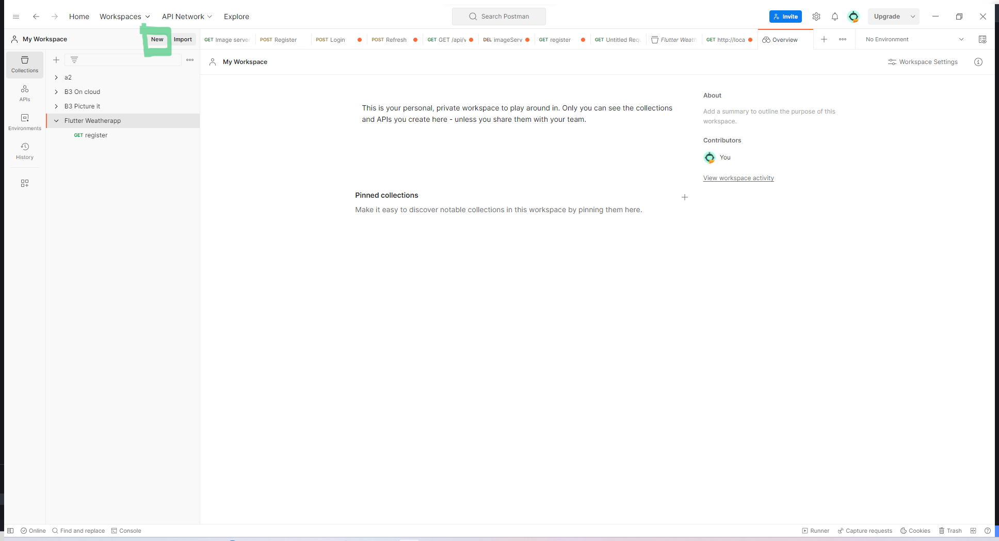
3. Select A HTTP method.
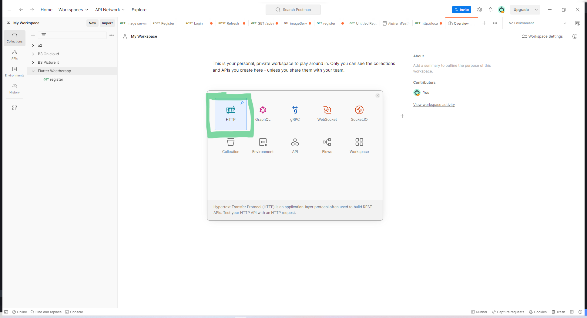
4. Enter the following URL: `http://localhost:8080/stock/quote?symbol=AAPL&from=Y&to=X`

replace the Xs with the time you copied in step 1.  
replace the Y with the time you copied in step 1, **but reduce the fourth digit from the right by 1.**  

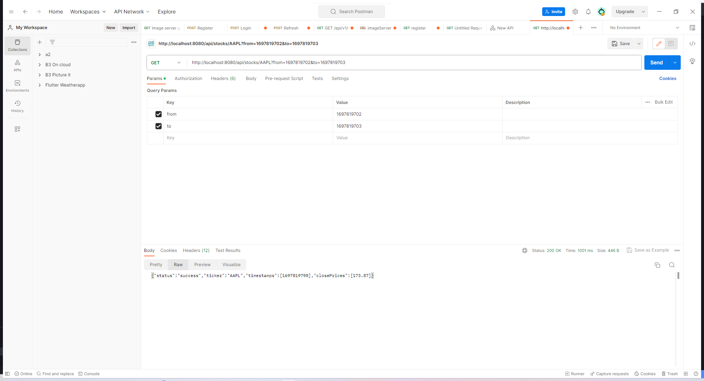

5. Press send.

#### Expected result

1. The reply should be a JSON Object with the following structure:

  ```json
{
    "status": "success",
    "ticker": "AAPL",
    "timestamps": [
        1696809600,
        1696896000,
        1696982400,
        1697068800,
        1697155200,
        1697414400,
        1697500800,
        1697587200,
        1697673600,
        1697760000
    ],
    "closePrices": [
        178.99,
        178.39,
        179.8,
        180.71,
        178.85,
        178.72,
        177.15,
        175.84,
        175.46,
        173.9
    ]
}
  ```

2 The status should be "success".

3  The ticker should be "AAPL".

4 The timestamps and closePrices arrays should contain at least 8 values. Most likely they will contain 10 values, but this is not guaranteed depending on when you run the test, due to market holidays.

5 The timestamps array should be as long as the closePrices array.

### Test 2. The system should not overstep the Finnhub.io API rate limit

Note: this test will fail if the Finnhub.io API is down,

1. open the termial where the backend is running and keep it open and visible.  
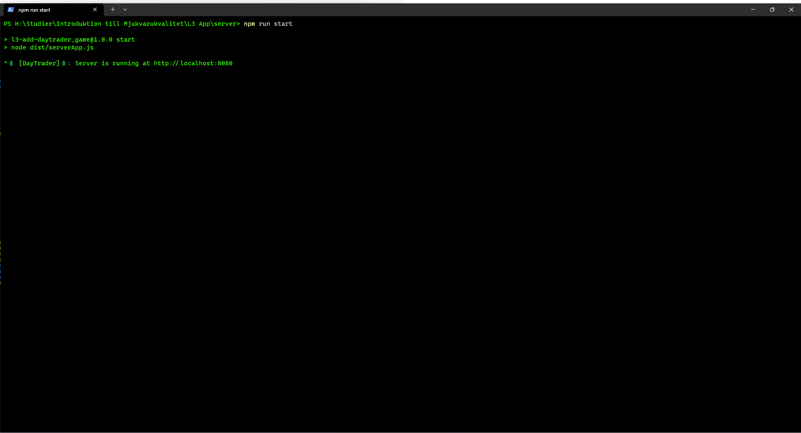

2. start the client side application from another terminal, and keep it open.  
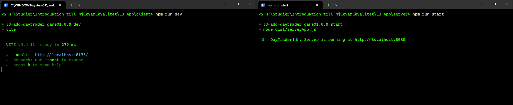

3. open a browser and navigate to localhost:XXXX where XXXX is the port the frontend is running on in the terminal from step 2.

4. refresh the browser page **20 times** in a row, **as fast as you can.**

5. observe the terminal from step 1.

#### Expected result

1. The terminal from step 1 should not display any error messages.

2. The terminal should state that 1 or more request have been queued.  
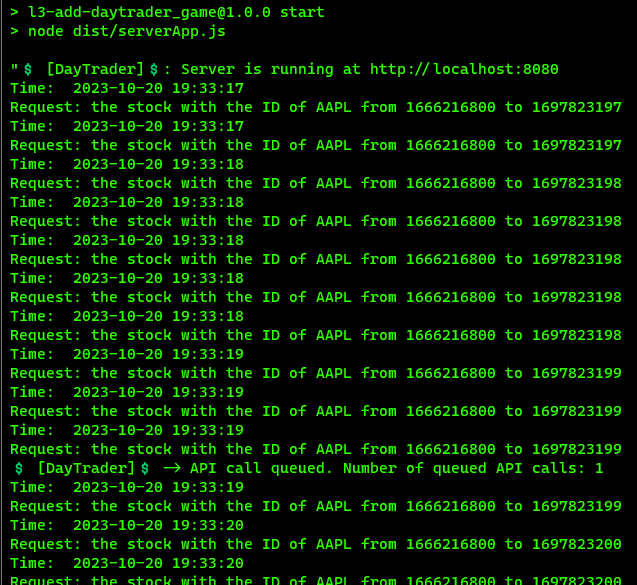

## Web application tests

### Test 3: The game should use the graphdrawer-component to draw a graph of the stock price over time

1. Open a browser and navigate to localhost:XXXX where XXXX is the port the frontend is running on.
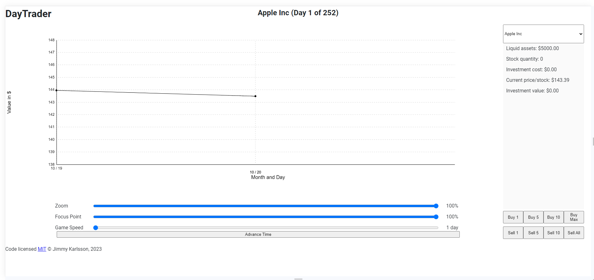

2. Click the "Advance time" button a few times.

#### Expected result

1. The time should advance by 1 day each time you click the button.

2. The stock price should be updated and the graph should be redrawn each time you click the button.
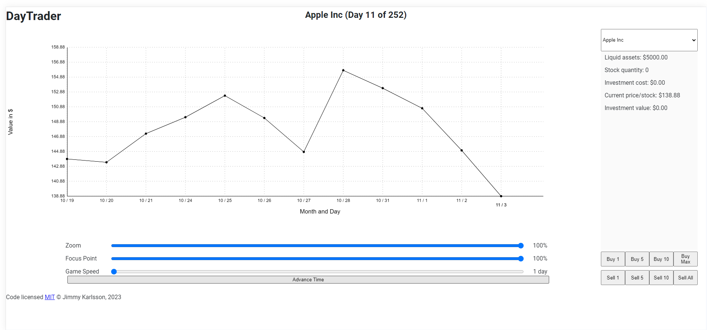

### Test 4: The user should be able to buy and sell stocks

1. Open a browser and navigate to localhost:XXXX where XXXX is the port the frontend is running on, if you haven't already.

2. Look at the table of owned stocks, and note no stocks are owned.  
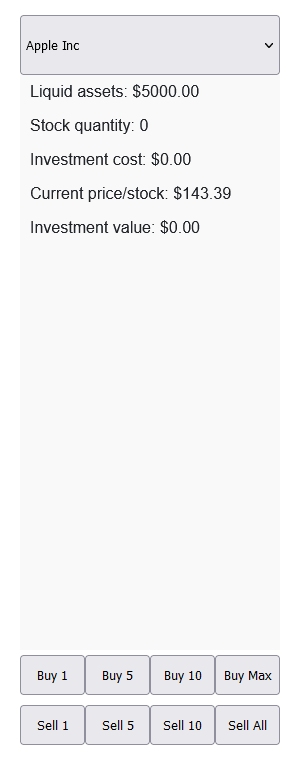

3. Click the "Buy 1" button.

4. Click the "Buy 5" button.

5. Click the "Buy 10" button.

6. Click the "Buy Max" button.

7. Look at the table of owned stocks, and note that stocks are owned.  
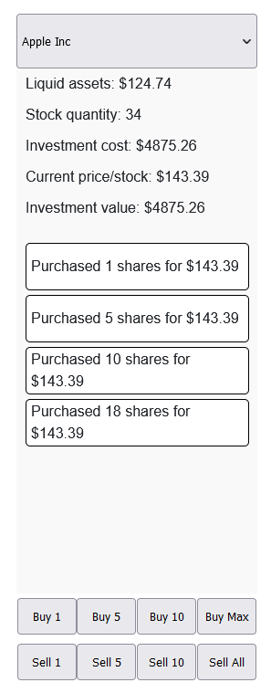

8. Click the "Sell 10" button and note that the stocks are sold any you have a post of 6, and a post of X number of stocks.

9. Click the "Sell 5" button and note that the stocks are sold any you have a post of 1, and a post of X number of stocks.

10. Click the "Sell 1" button and note that the stocks are sold and you only have a post of X number of stocks.

11. Click the "Sell Max" button and note that the stocks are sold and you don't have any stocks left.

#### Expected result

1. The user should be able to buy and sell stocks.

### Test 5: The user should be able to see the current stock price & Test 6: The user should be able to see the current value of their portfolio

1. Open a browser and navigate to localhost:XXXX where XXXX is the port the frontend is running on, if you haven't already.

2. Look at the table of owned stocks, and note no stocks are owned, and the current investment value of the portfolio is 0.  


3. Look at the current price / stock.

4. Click the "Buy 10" button.

5. Note that the investment value of the portfolio is updated and is now 10 times the current price / stock.  
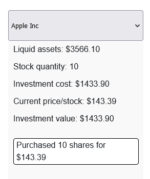

#### Expected result

1. The user should be able to see the current stock price.

2. The user should be able to see the current value of their portfolio.

### Test 7: The user should be able to set the game speed

1. Open a browser and navigate to localhost:XXXX where XXXX is the port the frontend is running on.


2. Click the "Advance time" button. Note that the time advances by 1 day to day 2.

3. Drag the game speed slider to the right, the game speed is now 2 days per click.

4. Click the "Advance time" button. Note that the time advances by 2 days to day 4.

5. Drag the game speed slider to the right, the game speed is now 1 week per click.

6. Click the "Advance time" button. Note that the time advances by 7 days to day 11.

7. Drag the game speed slider to the right, the game speed is now 2 weeks per click.

8. Click the "Advance time" button. Note that the time advances by 14 days to day 25.

9. Drag the game speed slider to the right, the game speed is now 1 month per click.

10. Click the "Advance time" button. Note that the time advances by 30 days to day 55.  
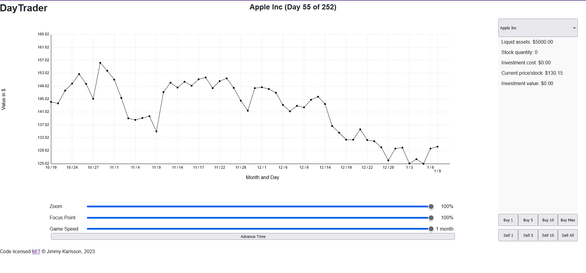

#### Expected result

1. The user should be able to set the game speed.

2. After following the steps above, the time should advance by 1 day, 2 days, 1 week, 2 weeks, 1 month each time you click the button.

3. After following the steps above, the day should be 55.

### Test 8: The player should be able to see sections of the graph, to see how the price has changed over time

1. Open a browser and navigate to localhost:XXXX where XXXX is the port the frontend is running on.

2. Set the game speed to 1 month and click the "Advance time" button 4 times.

3. Grab the zoom slider and drag it to the left. Note that the graph is zoomed in and the time range is reduced.

4. Grab the focus slider and drag it to the left. Note that the graph shows a different earlier time range.

4. Grab the zoom slider and drag it to the right. Note that the graph is zoomed out and the time range is increased.

#### Expected result

1. The player should be able to see sections of the graph, to see how the price has changed over time.

### Test 9: When the player leaves the game, the game should be saved &  Test 10: When the player returns to the game, the game should be loaded

1. Open a browser and navigate to localhost:XXXX where XXXX is the port the frontend is running on.

2. Set the game speed to 1 month and click the "Advance time" button 1 time.

3. Select the first stock in the table of owned stocks, then click the "buy 1" button.

4. Select the second stock in the table of owned stocks, then click the "buy 5" button.

5. Select the third stock in the table of owned stocks, then click the "buy 10" button.

6. Close the browser tab.

7. Open a browser and navigate to localhost:XXXX where XXXX is the port the frontend is running on, you should see a message saying "There is a save, would you like to continue?".  
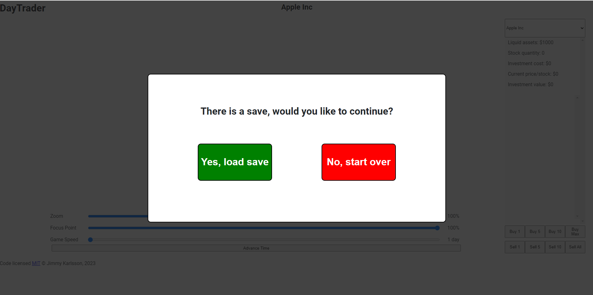

8. Click the "Yes, load game" button.

9. Note that the game is loaded and your stocks are still owned.

#### Expected result

1. When the player leaves the game, the game should be saved.

2. When the player returns to the game, the game should be loaded.

### Test 11: When the game is over, the player should be able to see their score and compare it to other players

1. Open a browser and navigate to localhost:XXXX where XXXX is the port the frontend is running on.

2. Set the game speed to 1 month and click the "Advance time" until its disabled.

3. The game is now over and you are presented with your portfolios value development over time, and your score.
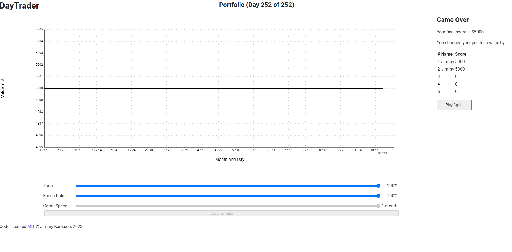

#### Expected result

1. When the game is over, the player should be able to see their score and compare it to other players in the highscore list.